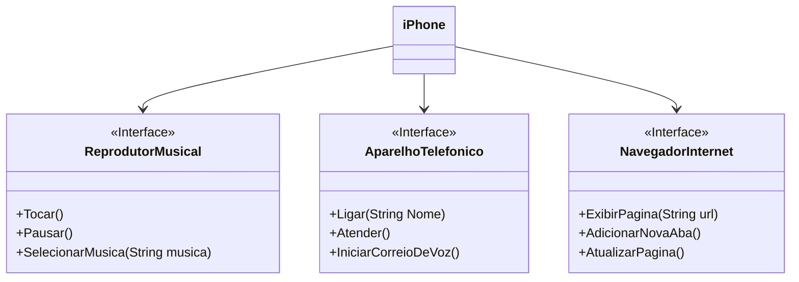

# DIO-trilha-java_POO-desafio:
Simulação de projeto do software do Iphone (2007), baseado em suas principais funcionalidades. Tem como objetivo somente interpretar noções envolvendo Herança, polimorfismo e abstração, usando como base o projeto de um Iphone.

## Proposta
Com base no vídeo de [lançamento do iPhone de 2007](https://www.youtube.com/watch?v=9ou608QQRq8), você deve elaborar a diagramação das classes e interfaces utilizando uma ferramenta UML. Em seguida, implemente as classes e interfaces no formato de arquivos `.java`.

## Diagrama UML (Mermaid)

